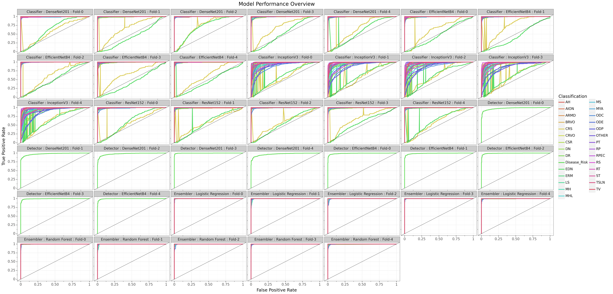
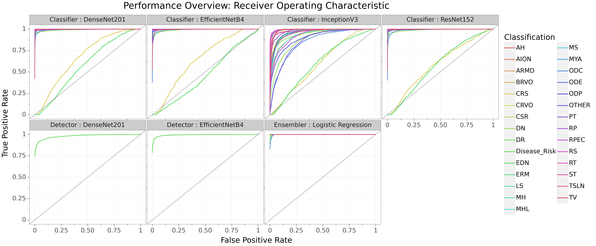

# Multi-Disease Detection in Retinal Imaging based on Ensembling Heterogeneous Deep Learning Models

[](https://doi.org/10.5281/zenodo.4573990)
[](https://www.gnu.org/licenses/gpl-3.0.en.html)

Preventable or undiagnosed visual impairment and blindness affects billion of people worldwide. Automated multi-disease detection models offer great potential to address this problem via clinical decision support in diagnosis. In this work, we proposed an innovative multi-disease detection pipeline for retinal imaging which utilizes ensemble learning to combine the predictive power of several heterogeneous deep convolutional neural network models. Our pipeline includes state-of-the-art strategies like transfer learning, class weighting, real-time image augmentation and focal loss utilization. Furthermore, we integrated ensemble learning techniques like heterogeneous deep learning models, bagging via 5-fold cross-validation and stacked logistic regression models.

Participation at the Retinal Image Analysis for multi-Disease Detection Challenge (RIADD):  
https://riadd.grand-challenge.org/

The models, predictions, metadata and evaluation results (scores, figures) are available under the following Zenodo repository:  
https://doi.org/10.5281/zenodo.4573990

## Reproducibility

**Requirements:**
- Ubuntu 18.04
- Python 3.6
- NVIDIA TITAN RTX or a GPU with equivalent performance

**Step-by-Step workflow:**  

Download Git repository:
```sh
git clone https://github.com/frankkramer-lab/riadd.aucmedi.git
cd riadd.aucmedi/
```

Install our in-house developed image classification framework AUCMEDI and all other required module dependencies:
```sh
pip install -r requirements.txt
```

Adjust the RFMiD image directory path of all scripts in the 'configuration' section.

```sh
# Train detector models
python scripts/detector_DenseNet201.py
python scripts/detector_EfficientNetB4.py

# Train classifier models
python scripts/classifier_DenseNet201.py
python scripts/classifier_InceptionV3.py
python scripts/classifier_ResNet152.py
python scripts/classifier_EfficientNetB4.py

# Train Logistic Regression models
python scripts/ensemble_training.py

# Run Inference
python scripts/inference.py
python scripts/ensemble.py

# Perform result evaluation
python scripts/evaluation.py
```

## Dataset: RFMiD

**Reference:**
https://riadd.grand-challenge.org/

    Pachade S, Porwal P, Thulkar D, Kokare M, Deshmukh G, Sahasrabuddhe V, Giancardo L, Quellec G, Mériaudeau F.
    Retinal Fundus Multi-Disease Image Dataset (RFMiD): A Dataset for Multi-Disease Detection Research.
    Data. 2021; 6(2):14.
    https://doi.org/10.3390/data6020014

The new Retinal Fundus Multi-Disease Image Dataset (RFMiD) consists of 3200 fundus images and contains 46 retinal conditions including various rare and challenging to detect diseases.  
The dataset was published associated to the Retinal Image Analysis for Multi-Disease Classification (RIADD) challenge from the ISBI 2021. The aim was to multi-label classify different sized retinal microscrope images.

Microscope distribution:  
{(1424, 2144, 3): 1493, (1536, 2048, 3): 150, (2848, 4288, 3): 277}


This dataset consists of diseases/abnormalities (diabetic retinopathy (DR), age-related macular degeneration (ARMD), media haze (MZ), drusen (DN), myopia (MYA), branch retinal vein occlusion (BRVO), tessellation (TSLN), epiretinal membrane (ERM), laser scar (LS), macular scar (MS), central serous retinopathy (CSR), optic disc cupping (ODC), central retinal vein occlusion (CRVO), tortuous vessels (TV), asteroid hyalosis (AH), optic disc pallor (ODP), optic disc edema (ODE), shunt (ST), anterior ischemic optic neuropathy (AION), parafoveal telangiectasia (PT), retinal traction (RT), retinitis (RS), chorioretinitis (CRS), exudation (EDN), retinal pigment epithelium changes (RPEC), macular hole (MHL), retinitis pigmentosa (RP), cotton wool spots (CWS), coloboma (CB), optic disc pit maculopathy (ODPM), preretinal hemorrhage (PRH), myelinated nerve fibers (MNF), hemorrhagic retinopathy (HR), central retinal artery occlusion (CRAO), tilted disc (TD), cystoid macular edema (CME), post traumatic choroidal rupture (PTCR), choroidal folds (CF), vitreous hemorrhage (VH), macroaneurysm (MCA), vasculitis (VS), branch retinal artery occlusion (BRAO), plaque (PLQ), hemorrhagic pigment epithelial detachment (HPED) and collateral (CL)) based on their visual characteristics as shown in the Figure below.


## Methods

The implemented medical image classification pipeline can be summarized in the following core steps:
- Class Weighted Focal Loss and Upsampling to conquer Class Imbalance
- Stratified Multi-label 5-fold Cross-Validation
- Extensive real-time image augmentation
- Multiple Deep Learning Model Training
- Distinct Training for Multi-Disease Labels and Disease Risk Detection
- Ensemble Learning Strategy: Bagging & Stacking
- Stacked Binary Logistic Regression Models for Distinct Classification


This pipeline was based on AUCMEDI, which is an in-house developed open-source framework to setup complete medical image classification pipelines with deep learning models on top of Tensorflow/Keras⁠. The framework supports extensive preprocessing, image augmentation, class imbalance strategies, state-of-the-art deep learning models and ensemble learning techniques. The experiment was performed in parallel with multiple NVIDIA TITAN RTX GPUs.

## Results & Discussion



Receiver operating characteristic (ROC) curves for each model type applied in our pipeline. The ROC curves showing
the individual model performance measured by the true positive and false positive rate. The cross-validation models were
macro-averaged for each model type to reduce illustration complexity.



In our participation, we were able to reach rank 18 from a total of 58 teams. In the independent evaluation from the challenge organizers, we achieved an AUROC of 0.95 for the disease risk classification. For multi-label scoring, they computed the average between the macro-averaged AUROC and the mAP, for which we reached the score 0.70. The top performing ranks shared only a marginal scoring difference which is why we had only a final score difference of 0.05 to the first ranked team.

We were able to validate and demonstrate high accuracy and reliability of our pipeline, as well as the comparability with other state-of-the-art pipelines for retinal disease prediction.

## Author

Dominik Müller  
Email: dominik.mueller@informatik.uni-augsburg.de  
IT-Infrastructure for Translational Medical Research  
University Augsburg  
Bavaria, Germany

## How to cite / More information

Dominik Müller, Iñaki Soto-Rey and Frank Kramer. (2021)   
Multi-Disease Detection in Retinal Imaging based on Ensembling Heterogeneous Deep Learning Models.  
arXiv e-print: Coming soon!

```
Article{riaddMUELLER2021,
  title={Multi-Disease Detection in Retinal Imaging based on Ensembling Heterogeneous Deep Learning Models},
  author={Dominik Müller, Iñaki Soto-Rey and Frank Kramer},
  year={2021}
}
```

Thank you for citing our work.

## License

This project is licensed under the GNU GENERAL PUBLIC LICENSE Version 3.  
See the LICENSE.md file for license rights and limitations.
